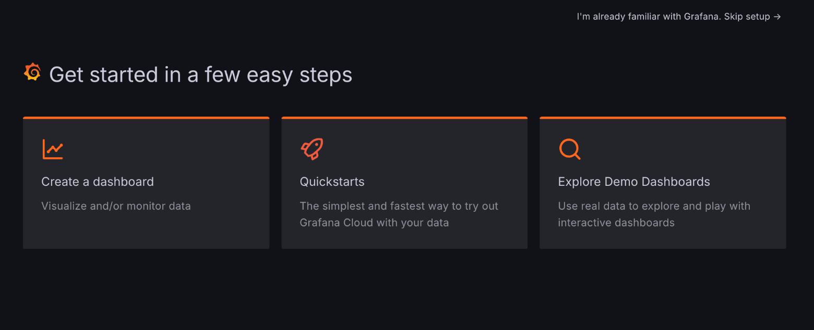

# Grafana ダッシュボード作成ハンズオン

## はじめに

このハンズオンでは、Grafanaを使用してダッシュボードを作成する基本的なスキルを学びます。TestDataソースを使用して、様々なタイプのビジュアライゼーションを作成し、ダッシュボードをカスタマイズする方法を学びます。

## ハンズオンのゴール

このGrafanaハンズオンでは、Grafana Cloudの基本操作を学び、TestDataソースを活用してデータ可視化の基礎を習得します。ビジュアライゼーションの編集とアラート機能の設定を通じて、ダッシュボード構築の基礎を学びます。

- Grafana Cloudの基本的な操作とナビゲーション
- TestDataソースを使用したデータの可視化
- 複数のタイプのビジュアライゼーションの作成と設定
- ダッシュボードの構築とカスタマイズ
- 変数を用いた動的なダッシュボードの作成
- アラート機能の設定と通知の作成

## ハンズオン環境の前提条件

本ハンズオンは、Grafana Cloudの`Grafana v11.2.0-73179`を対象としています。全てのハンズオンは、ブラウザで完結します。

## 事前準備

今回のハンズオンでは、Grafana環境として[Grafana Cloud](https://grafana.com/ja/products/cloud/)を利用します。ハンズオンの利用範囲では無料での利用が可能です。

### アカウントセットアップ方法

[Sign Up \- Create User](https://grafana.com/auth/sign-up/create-user?pg=login)、アカウントを登録します。


作成するStack名とリージョン（特にこだわりがなければ、JapanでOK）を選択し、セットアップを完了します。


既にGrafana Cloudのアカウントをお持ちの方は、そのままサインインしてください。

ログイン直後、以下のようなeasy stepガイドが表示されたら、一旦なにもせずに、右上の「I'm already familiar with Grafana. Skip setup」をクリックしてください。



## Grafana基礎講座

最初に、ハンズオンで必要となるGrafanaの基礎知識について解説します。今回は、以前GrafanaMeetupで登壇したときの資料を元にざっくりとしたダッシュボードの基礎について解説します。

[20分で完全に理解するGrafanaダッシュボード \- Speaker Deck](https://speakerdeck.com/hamadakoji/20fen-tewan-quan-nili-jie-surugrafanadatusiyubodo?slide=24)

- Grafanaのダッシュボードの基礎を理解する
  - 見るべきドキュメント
  - ダッシュボード関連のコンポーネント
- サンプルデータを使いダッシュボードを作ってみる
  - ダッシュボードを作る時に始めるコト
  - ダッシュボードに関する公式マニュアル
  - 【重要】公式マニュアルを読むときのTips
  - Grafanaで用意されているデモ用App
  - TestData Data source

## Grafana Cloudへのログイン

Grafana Cloudへログイン後、作成したStackを選択し、[Manager your stack]一覧を表示。Grafanaの[Launch]をクリックし、Grafanaのホーム画面を表示します。


## TestDataソースの設定

ハンズオンで利用するためのTestDataソースの設定を行います。

1. 左側のメニューから[Connections]をクリック。
2. [Add new connection]をクリック。
3. 検索バーに`TestData`と入力して、TestDataを選択。右上の[Add new Datasource]をクリック。
4. [Save & Test]をクリック。

Settingsタブが選択され設定画面が表示されます。そのままで大丈夫です。[Default]スイッチをオンにしておくと、今後Visualizationの追加時に常にこのデータソースが初期選択されるので、今回のハンズオン実施時は便利です。


TestDataソースには、`Scenario`と呼ばれる、クエリエディタの代わりとなるパネル用にシミュレートする機能が存在します。この`Scenario`を利用することで、クエリエディタの文法を意識する前に、各種グラフの表現方法や機能を学ぶことができます。

TestDataソースについての詳細は、以下公式ドキュメントを参照。

- [TestData data source](https://grafana.com/docs/grafana/latest/datasources/testdata/)


## 最初のダッシュボードの作成と保存

1. 左側のメニューから[Dashboards]を選択、[New]ボタンを展開し、[New dashboard]をクリック。
2. [Add visualization]をクリック。
3. [SEelect data source]で`grafana-testdata-datasource`を選択。
4. Scenarioで`CSV Metric Values`を選択。
5. 右上の[Save dashboard]ボタンをクリックし、Titleに`My First handson dashboard`と入力し、[Save]をクリック。
6. [Back to dashboard]をクリック。

ここまでで、ひとまずダッシュボードの作成と保存が完了します。このあと、ダッシュボードのパネルを編集しながら、ダッシュボードの基本的な機能を確認していきます。

## ダッシュボードの基本機能の確認とPanelの表示

1. 左側のメニューから[Dashboards]を選択。
2. 先ほど作成した`My First handson dashboard`を選択。
3. 作成したPanelが表示されているので、マウスオーバーし右上の[︙]を選択し、[Edit]をクリック。


以下のPanel Editorが表示されます。基本的なパネルの編集はここで行います。


## Time seriesによるデータの可視化

Time seriesは、時系列のデータをグラフとして表示する、Grafanaダッシュボードにおいてデフォルトかつ重要なVisualizationです。時系列データを、線、点、棒ごして表示することができ、ほぼすべての時系列データの表示利用可能な汎用性があります。

1. 上述の手順の流れで、Panelの編集画面を表示。
2. Data sourceに`grafana-test-data-datasource`を選択。
3. Scenarioに`Random Walk`を選択し、時系列データを表示。

`Random Walk`は時系列に無作為なデータが格納されているため、Time seriesのVisualizationを学ぶのに適しています。X軸に時間、Y軸に値が設定されています。

### 時間範囲の操作

時間範囲は、ダッシュボードの時間範囲セレクターを利用して設定可能。


また、グラフ内をマウスカーソルで範囲指定することで、特定範囲にズームすることもできます。


TestDataソースのRandom Walkは、かなり細かい時系列でデータが設定されているので、範囲を拡大したり縮小しながら、時間範囲指定の方法に慣れてください。

時間範囲セレクターの右側で、グラフの更新間隔が設定できます。


TestDataソースのRandom Walkは静的なデータではなく常に更新されるデータのため、更新間隔を指定することで、常に新しいデータを表示することが可能です。

- [Last 1 hour]を選択し、リアルタイムデータを観察。
- [Last 6 hours]に変更し、より長期のトレンドを確認。
- カスタム範囲を選択し、特定の期間のデータを表示。

## Panel option設定

パネルの代表的なオプションの設定方法を学びます。以下に、パネル設定の代表的な設定項目を記載しますが、これ以外にも直感的に編集できるものは多数あるので、まずは編集して見た目がどのように変わるか体験してみてください。


### 基本的なスタイリング

1. 右側の[Panel]タブをクリック。
2. [Graph styles]セクションで：
   - [Line width]を2に変更。
   - [Fill opacity]を50に設定。
   - [Point size]を5に設定し、データポイントを表示。
3. [Standard options]セクションで、[Unit]に`Misc`と入力し[percent (0-100)]に設定


### Legend（凡例）の調整

1. [Legend]セクションを展開。
2. [Display mode]を[List]から[Table]に変更。
3. [Placement]を[Bottom]から[Right]に変更。
4. [Values]で[Min]、[Max]、[Last]をオン。

### Axis（軸）の設定

1. [Axis]セクションを展開。
2. [Placement]を[Auto]から[Left]に変更。
3. [Label]に「ランダム値」と入力。
4. [Scale]を[Linear]から[Logarithmic]に変更し、違いを観察。

### 設定の確認と調整

1. グラフ上でカーソルを動かし、Tooltipの動作を確認。
2. 凡例の表示を確認し、各値の意味を理解。
3. Y軸のラベルと目盛りの変化を観察。

ここまでで、代表的なPanel Optionの設定内容を体験していただきました。どのVisualizationを使っても、ここには膨大な設定項目がありますが、共通で設定できるものも多いので、ここまでで体験した内容を他のVisualizationでも活かしてください。

結局は、触りまくって「慣れ」てもらうのが一番早いです。みていてもよくわからない設定項目は公式ドキュメントを参考にしてみてください。

## アラートしきい値の可視化

グラフ上にしきい値となるラインを表示ししきい値に応じてスタイルを変更することで、しきい値を超えた値を直感的に把握できるようにします。

### 基本的なしきい値の設定

1. [Panel]タブの[Thresholds]セクションを展開。
2. [Add threshold]をクリック。
3. 値を50に設定し、色を黄色に。
4. もう一つ[Add threshold]をクリックし、値を70に設定、色を赤に。
5. [Show thresholds]で[As lines]を選択。
6. グラフ上でしきい値ラインの表示を確認。

このようにラインが表示されればOK。


もしラインが表示されない場合、以下を試してみてください。

- グラフのY軸の範囲設定:
  - [Panel] > [Standard options]で[Min]と[Max]の値を確認。
  - しきい値がこの範囲内に収まっているか確認。
- データの範囲:
  - 表示されているデータの値の範囲を確認。
  - しきい値がデータの範囲内にあるか確認。
- パネルの再読み込み
  - 設定後にパネルが正しく更新されていない可能性。
  - ダッシュボードの更新やパネルの再読み込みを試行。

### しきい値モードの変更

1. [Thresholds]セクションの[Mode]を[Absolute]から[Percentage]に変更。
2. しきい値の値を適宜調整（例：50%と75%）。
3. グラフ上でしきい値の変化を観察。

### しきい値のスタイル調整

1. [Thresholds]セクションの[Style]を[As lines]から[As filled regions and lines]に変更。
2. グラフ上での表示の違いを確認。

### しきい値に基づく条件付き書式

1. [Standard options]セクションまでスクロール。
2. [Color scheme]を[From thresholds(by value)]に変更。
3. [Color series by]を変更しながら、グラフ全体の色がしきい値に基づいて変化することを確認。

### まとめ

1. グラフ上でデータの変動を観察し、しきい値との関係を確認。
2. 必要に応じてしきい値の値や色を微調整。
3. 異なるタイムレンジでグラフを表示し、しきい値の効果を確認。
4. しきい値の視認性とグラフの全体的な見やすさのバランスを取る。

しきい値の設定ですが、Time seriesでも利用可能ですが、Gaugeのような単一の値を表示するVisualizationなどでも利用可能です。基本のパネル編集の概念として覚えておきましょう。


## 複数のMetricsの追加

同一グラフ上に複数のメトリクスを追加することで、それぞれのメトリクスの表示差分や統計情報の表示し、スタイルを変更します。

### 新しいクエリの追加

1. パネル編集画面の[Queries]タブをクリック。
2. 既存のクエリの下にある[Add query]ボタンをクリック。
3. 新しいクエリ（B）が追加されたことを確認。

### 2つ目のRandomWalkの設定

1. クエリBのScenarioドロップダウンから[Random Walk]を選択。
2. [Alias]フィールドに「Second Metric」と入力。
3. [Series count]を1に設定。
4. [Start value]を50に設定。

### クエリの調整

1. クエリAの[Alias]を「First Metric」に変更。
2. クエリAの[Start value]を25に設定。
3. 両方のクエリの[Min]をnone、[Max]を100に設定。

ここまでで、2つの異なる線がグラフに表示されていることを確認。

### 凡例の調整

1. [Panel]タブの[Legend]セクションを展開。
2. [Display mode]を[Table]に設定。
3. [Placement]を[Bottom]に設定。
4. [Values]で[Min]、[Max]、[Total]、[Mean]をオン。

### 色の調整

1. [Panel]タブの[Standard options]セクションを展開。
2. [Color scheme]を[From thresholds(by value)]に変更。
3. [Thresholds]を追加し、メトリクスの色の変化を確認。

このようなイメージになるかと思います。


### Tooltipの設定

1. [Tooltip]セクションを展開。
2. [Mode]を[All]に設定。
3. [Sort order]を[Descending]に設定。

### メトリクスの比較

1. グラフ上でマウスを動かし、両方のメトリクスの値を比較。
2. 凡例の情報を確認し、各メトリクスの統計値を比較。

### 時間範囲の調整

1. ダッシュボード上部の時間範囲セレクターを使用。
2. 異なる時間範囲で2つのメトリクスの挙動を観察。


## データの変換と処理

Transformationsは、ダッシュボードを視覚化する前に、クエリが返したデータを操作する強力な方法です。Transformationsを利用すると、以下のことが可能になります。

- フィールド名の変更
- 時系列/SQLのようなデータの結合
- クエリ間での数学的操作の実行
- 変換後の出力を別の変換の入力として利用

じデータセットの複数のビューに依存しているユーザーにとって、変換は多数のダッシュボードを作成および管理する効率的な方法を提供します。

> 変換されたデータをグラフ化できないことがあります。そのような場合は、パネル編集画面の上にあるテーブルビューのトグルをクリックして、データのテーブルビューに切り替えることで、変換結果を確認し理解するのに役立ちます。

### Reduce変換の設定

1. [Transformations]タブをクリック。
2. [Add another transformation]ボタンをクリック。
3. [Reduce]を選択。
4. [Calculations]から[Max]、[Min]、[Mean]、[First]を選択。
5. Visualizationから[Stat]選択。
6. Reduceで選択した値が表示されていることを確認。

Time seriesは基本的に時系列データの表示に利用するので、単一値を複数表示するときはStatやGaugeを利用します。


確認が終わったら、VisualizationをTime seriesに戻して、追加したTransformationsを削除してください。

### データ範囲の制限

1. [Transformations]タブをクリック。
2. [Add transformation]ボタンをクリック。
3. [Limit]を選択。
4. 値を200に設定。
5. グラフのデータポイントが横に制限されることを確認。
6. Transformationを削除して範囲制限を元に戻す。

ここまでが基本的なTransformationの使い方になります。ここからさきは計算式を利用したTransformationを表示します。

### 数式の適用

1. ダッシュボード選択画面で[Add -> Visualization]をクリック。
2. [Queries]で[Random Walk]を選択し1つ目のメトリクスを追加
3. 下にある[Add query]ボタンをクリック。
4. 新しいクエリ（B）が追加されたことを確認。
5. [Start value]を50に設定。
6. 2つのメトリクスが表示されていることを確認

この後、Transformationsを追加します。

1. [Add transformation]をクリック。
2. [Add field from calculation]を選択。
3. [Mode]を[Binary operation]に設定。
4. 左側を[A-series]、中央の[Operation]を[+]、右側を[B-series]に設定
5. [Alias]に「Sum Value」と入力。
6. A-seriesとB-seriesの合計が折れ線グラフで表示されていることを確認

また、以下の操作で、A-seriesとB-seriesの平均を表示します。

1. [Add transformation]をクリック。
2. [Add field from calculation]を選択。
3. [Mode]を[Reduce row]に設定。
4. [Operation]を[A-series]と[B-series]を選択。
5. [Calculation]を「Mean」と入力。
6. A-seriesとB-seriesの平均が折れ線グラフで表示されていることを確認


## データの変換と処理（応用）

時系列ではないデータを利用して、他のTransformationの機能を試してみます。

### データの準備

1. 新しいダッシュボードを作成し、パネルを追加。
2. データソースとして[TestData DB]を選択。
3. Scenarioで[CSV Content]を選択。
4. [Content]に以下のCSVデータを入力：

```
Time,Category,Value
2023-01-01 00:00:00,A,10
2023-01-01 01:00:00,B,20
2023-01-01 02:00:00,A,15
2023-01-01 03:00:00,C,30
2023-01-01 04:00:00,B,25
2023-01-01 05:00:00,A,12
2023-01-01 06:00:00,C,35
```

5. Visualizationで[Bar chart]を選択

以下のような画面が表示されることを確認。


### データの並べ替え

1. [Transformations]タブをクリック。
2. [Add transformation]ボタンをクリック。
3. [Sort by]を選択。
4. [Sort by]フィールドで[Value]を選択。
5. データが値が降順に並べ替えられたことを確認。
6. [Reverse]ボタンをクリック。
7. データが値が昇順に並べ替えられたことを確認。

### データのグループ化

1. [Add transformation]をクリック。
2. [Group By]を選択。
3. [Category]フィールドで[Group by]を選択。
4. [Value]フィールドで[Calculate]を選択、Total, Min, Max, Meanを入力。
5. Category単位で、Valueがそれぞれ集計されて表示されていることを確認。

Transformationsの設定内容も含めて、このようなイメージになっていればOKです。


### 複数の変換の組み合わせ

1. これまでに適用したTransformationの順序を確認。
2. ドラッグ&ドロップで変換の順序を変更（例：グループ化を先に行い、その後で並べ替え）。
3. 各ステップでの変換の効果を観察。

### フィルタリングの追加

1. [Add transformation]をクリック。
2. [Filter data by values]を選択。
3. [Filter type]で[Exclude]を選択。
4. [Conditions]で[Match all]を設定。
5. [Add condition]をクリック。
   - [Field]に[Category]
   - [Match]に[Is equal]
   - [Value]に[A]

上記により、カテゴリーがAに等しいデータをExclude（除外）します。結果として、グラフ上でCategoryがAのデータが非表示になっていれば想定通りです。

### 他のVisualizationの確認

1. 右側の[Visualizations]の横にある[Suggestions]タブをクリック。
2. 現在のデータソースで利用できるVisualizationsがイメージ表示されるので、異なるVisualizationsを選択して、表示データを確認。


Grafanaを利用していると、Queryを設定してもダッシュボードに何も表示されないことがよくあります。これは、Queryで取得されたデータがそのVisualizationに対応していないために起こる事象なのですが、このSuggestions機能を利用することで、そのデータを利用して表示できるVisualizationsがひと目で把握可能なので、迷ったときはすぐにこちらを確認することをオススメします。


## 変数を用いた動的なダッシュボードの作成

Grafanaの「変数」機能について。

Grafanaの変数機能を利用することで、より柔軟なダッシュボードを作成できます。変数を使用することで、ユーザーはダッシュボードの内容を対話的に変更でき、同じダッシュボードで異なるデータセットやシナリオを簡単に探索できるようになります。

変数の主な利点：

-  再利用性：一つのダッシュボードで複数のデータソース、サーバー、メトリクスを表示できます。
-  インタラクティブ性：ユーザーはドロップダウンメニューやその他の入力方法を通じて、表示するデータを動的に選択できます。
-  効率性：複数の類似したダッシュボードを作成する代わりに、変数を使用して1つのダッシュボードをカスタマイズできます。
-  一貫性：変数を使用することで、ダッシュボード全体で一貫したデータ選択を確保できます。
-  テンプレート化：ダッシュボードのタイトルやパネルの説明に変数を使用して、コンテキストに応じた情報を提供できます。

このハンズオンでは、様々なタイプの変数（カスタム、クエリ、間隔など）の作成方法、それらをクエリやダッシュボード設定に組み込む方法、そして変数を使って動的でインタラクティブなダッシュボードを作成する方法を学びます。

## シンプルな変数の作成

1. Dashboardsを開き、右上の[Settings]をクリック。
2. [Variables]タブを選択。
3. [Add variable]ボタンをクリック。
4. 以下の設定を行う：
   - Select variable type: [Custom]
   - Name: `metric`
   - Label: `[Select Metric]`
   - Custom options: `cpu,memory,disk`
5. [Back to list]をクリックし、[Save dashboard]で、変数を保存する。

ここまでで、簡単な変数の作成は完了です。この変数を利用して、グラフのタイトルを変更します。

1. 新しいパネルを追加。
2. データソースとして[TestData DB]を選択。
3. Scenarioで[Random Walk]を選択。
4. [Alias]フィールドに`$metric`を入力。
5. ダッシュボード上部のドロップダウンに`[Select Metric]`が表示されていることを確認。
6. ドロップダウンを選択することで、グラフの凡例（Alias）にドロップダウンで選択したValueが明記されていることを確認。

このように、あらかじめ定義していた変数は、ダッシュボードのクエリ設定時に`$変数名`で利用することが可能です。

## 変数のチャレンジ

- データの変換と処理（応用）で利用したCSVデータを利用して、TransformationsのFilterを利用して、変数でCategory（A or B or C）をフィルタできるように設定する。

## アラート機能

### アラートの基本概念

[Introduction to Alerting \| Grafana documentation](https://grafana.com/docs/grafana/latest/alerting/fundamentals/)

次の図では、Grafana Alerting の概要を説明し、Grafana Alerting の動作原理となる基本的な機能のいくつかを紹介します。


*出典: [Introduction to Alerting \| Grafana documentation](https://grafana.com/docs/grafana/latest/alerting/fundamentals/)*


基本的な動作原理は以下の通り。

- Grafana Alertingは定期的にデータソースに問い合わせ、アラートルールで定義された条件を評価
- 条件に違反した場合、アラートインスタンスが発火
- 発火した（および解決された）アラートインスタンスは、コンタクトポイントに直接、またはより柔軟に通知ポリシーを通じて、通知のために送信

Grafanaのアラートを理解するための基礎用語を紹介します。簡単にこちらの内容を頭に入れておいてください。

- Alert rules
  - アラートルールは、監視したい条件を定義します。具体的には以下の要素で構成されます
  - クエリ：データソースから特定のメトリクスを取得する
  - 条件：メトリクスが特定のしきい値を超えた場合にアラートをトリガーする
  - 評価間隔：どの程度の頻度でルールを評価するか
  - 持続時間：条件が満たされた状態が続く必要がある時間

  例：「CPU使用率が5分間連続で80%を超えた場合にアラートを発生させる」

- Alert instances
  - 各アラートルールは複数のアラートインスタンス（アラートとも呼ばれる）を生成することができます。これは、1つの式で複数の時系列を観察できるため、非常に強力な機能です。
  - アラート・ルールは頻繁に評価され、それに応じてアラート・インスタンスの状態が更新されます。発火または解決状態にあるアラート・インスタンスのみが通知で送信されます。

- Contact points
  - コンタクトポイントは、通知メッセージと通知の送信先を決定します。
  - 例えば、メールアドレス、Slack、Grafana OnCallやPagerdutyなどのインシデント管理システム (IRM) 、または Webhookなどがあります。

- Notification policies
  - Notification policiesは、大規模システムのアラート通知を処理する柔軟な方法を提供します。
  - Notification policiesは、ラベルマッチングによってアラートをコンタクトポイントにルーティングします。


### アラート機能のハンズオン

ハンズオンですが、公式で紹介されているTutorialが非常によくできているので、こちらを参考に進めてください。

[Get started with Grafana Alerting \- Part 1 \| Grafana Labs](https://grafana.com/tutorials/alerting-get-started/)

- チュートリアル実施時のポイント
  - はっきり言って、Alert rulesの設定は初見の人にはだいぶ難しいです。
  - Grafana Cloudを利用している場合は、そのまま、Create a contact pointから始めてください。
  - contact pointにはWebhook.siteという、Webフックを受診できるURL作成サイトを利用します。
  - このハンズオンで想定しているGrafana Cloudの環境では、このチュートリアルのUIと完全に一致していました。落ち着いて進めてください。
  - もし時間に余裕があれば、以下のPart 2も進めてください。Alert instancesやNotification policiesについて学ぶことができます。
    - [Get started with Grafana Alerting \- Part 2 \| Grafana Labs](https://grafana.com/tutorials/alerting-get-started-pt2/)


### アラート機能のチャレンジ

以下の条件を満たすアラートを実装してください。

- 既存のcontact pointにEメール送信先を設定して、作成したアラートルールからWebフックと同時にEメールにも通知を飛ばすよう設定する。
- アラートルールのデータソースにTestDataソースのRandom Walkを指定し、Valueの平均値が50を超えた時にアラートルールが発泡するように設定する。
  - （ヒント）アラート設定時、ExpressionsにReduceを設定しThresholdで利用する値として定義する（下の画像を参考に）
  - 

## 今後に向けて

お疲れさまでした。ここまでで、基本的なダッシュボードのVisualizationについて手を動かして学ぶことができたかと思います。

今後に向けて、以下の部分をより深ぼってみるのをオススメします。

### 他のVisualizationsを試してみる

今回ハンズオンで紹介した以外にも、Grafanaには多数のVisualizationsが用意されています。

[Visualizations \| Grafana documentation](https://grafana.com/docs/grafana/next/panels-visualizations/visualizations/)

データソースを設定後、VisualizationsのSuggestionsをクリックすることで、他の表示形式を一覧で見ることができるので、その中から新しい表現方法を見て刺激をうけてみると、アイディアが刺激されて捗ることうけあいです。

### Demo Data Dashboardsを試してみる

サイドバーの[Apps] -> [Demo Data Dashboards]のクリックで、ビルトインのダッシュボードDemoをダッシュボードインストールすることができます。


より実践的なデータソースに紐づくVisualizationsの方式を多数見ることができます。初学者がいきなりこのDemoをみてもよくわからないことになりがちですが、ここまでのハンズオンで基礎を押さえておけば、より深ぼった学習ができるはずです。

### Grafana Playを試してみる

[Getting Started with Grafana Play \- Examples \- Dashboards \- Grafana](https://play.grafana.org/d/bdnahipisghdsa/getting-started-with-grafana-play)

Grafana PlayはGrafana Cloud上で動作する、Grafana学習用のサンドボックス環境です。自由に編集できるダッシュボードが多数用意されているので、ダッシュボードの一覧を眺めダッシュボードを編集しながらGrafanaのユースケースを掴むのにうってつけです。


### より多くのデータソースを試してみる

[Data sources \| Grafana documentation](https://grafana.com/docs/grafana/next/datasources/)

ここまでで、ダッシュボードの可視化部分の基礎はつかめたと思うので、実際に業務で利用しているデータソースを繋いで、クエリを書いてダッシュボードを構築してみましょう。

サイドバーの[Connections] -> [Add new connection]で、活用できるデータソースを探索し、まずは繋いで見るところから始めてみるのも面白いと思います。
