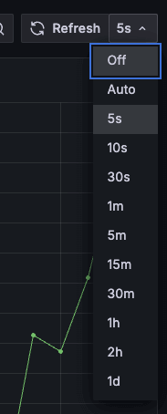
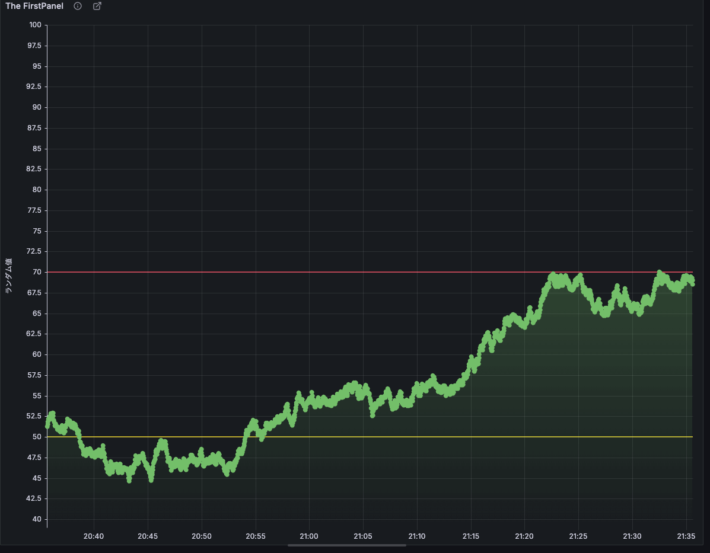

# Grafana ダッシュボード作成ハンズオン

## ハンズオンのゴール

このGrafanaハンズオンでは、参加者がGrafana Cloudの基本操作を学び、TestDataソースを活用してデータ可視化の基礎を習得します。グラフ、ゲージ、テーブルなど多様なビジュアライゼーションの作成と設定を通じて、効果的なダッシュボードの構築方法を体験します。

さらに、変数を用いた動的なダッシュボード作成や、作成したダッシュボードの保存・共有方法も学びます。これにより、参加者は実際の業務や個人プロジェクトでGrafanaを活用するための基礎的なスキルと知識を獲得し、データ駆動の意思決定に貢献できる能力を身につけることができます。

- Grafana Cloudの基本的な操作とナビゲーション
- TestDataソースを使用したデータの可視化
- 複数のタイプのビジュアライゼーション（グラフ、ゲージ、テーブルなど）の作成と設定
- ダッシュボードの構築とカスタマイズ
- 変数を用いた動的なダッシュボードの作成
- ダッシュボードの保存と共有の方法

## 環境の前提条件

本ハンズオンは、Grafana Cloudの`Grafana v11.2.0-73179`を対象としています。

## 事前準備

今回のハンズオンでは、Grafana環境として[Grafana Cloud](https://grafana.com/ja/products/cloud/)を利用します。ハンズオンの利用範囲では無料での利用が可能です。

### アカウントセットアップ方法

[Sign Up \- Create User](https://grafana.com/auth/sign-up/create-user?pg=login)、アカウントを登録します。

作成するStack名とリージョン（特にこだわりがなkれば、JapanでOK）を選択し、セットアップを完了します。

既にGrafana Cloudのアカウントをお持ちの方は、そのままサインインしてください。

## はじめに

このハンズオンでは、Grafanaを使用してダッシュボードを作成する基本的なスキルを学びます。TestDataソースを使用して、様々なタイプのビジュアライゼーションを作成し、ダッシュボードをカスタマイズする方法を学びます。

所要時間：約100分

## Grafana基礎講座

最初に、ハンズオンで必要となるGrafanaの基礎知識について解説します。

### 1. Grafanaとは？
- オープンソースの観測プラットフォーム
- データの可視化と分析のためのツール
- 多様なデータソースに対応

### 2. Grafanaの主な用途
- システム監視
- アプリケーションパフォーマンス分析
- ビジネスインテリジェンス
- IoTデータの可視化

### 3. Grafanaのアーキテクチャ
[アーキテクチャ図を挿入]
- フロントエンド（UI）
- バックエンド（サーバー）
- データソース
- プラグイン

### 4. ダッシュボードの基本
- ダッシュボードとは？
- パネルの概念
- レイアウトとグリッドシステム
- 変数とテンプレート

### 5. パネルとビジュアライゼーション
- グラフ
- ゲージ
- テーブル
- ヒートマップ
- その他のビジュアライゼーション

### 6. データソースとクエリ
- サポートされるデータソース
- クエリエディタの基本
- データ変換と処理

### 7. Grafanaの主要機能
- アラート
- アノテーション
- プラグイン
- ユーザー管理とアクセス制御

### 8. まとめ
- Grafanaの強み
- これから学ぶこと

## Grafanaへのログイン

Grafana Cloudへログイン後、作成したStackを選択し、[Manager your stack]一覧を表示。Grafanaの[Launch]をクリックし、Grafanaのホーム画面を表示します。

## TestDataソースの設定

ハンズオンで利用するためのTestDataソースの設定を行います。

1. 左側のメニューから[Connections]をクリック。
2. [Connections]メニューの中の[Data sources]をクリック。
3. 検索バーに`TestData`と入力。
4. `grafana-testdata-datasource`を選択。

Settingsタブが選択され設定画面が表示されます。そのままで大丈夫です。[Default]スイッチをオンにしておくと、今後Visualizationの追加時に常にこのデータソースが初期選択されるので、今回のハンズオン実施時は便利です。

TestDataソースには、`Scenario`と呼ばれる、クエリエディタの代わりとなるパネル用にシミュレートする機能が存在します。この`Scenario`を利用することで、クエリエディタの文法を意識する前に、各種グラフの表現方法や機能を学ぶことができます。

TestDataソースについての詳細は、以下公式ドキュメントを参照してみてください。

- [TestData data source](https://grafana.com/docs/grafana/latest/datasources/testdata/)

## 最初のダッシュボードの作成と保存

1. 左側のメニューから[Dashboards]を選択、[Create dashboard]をクリック。
2. [ADd visualization]をクリック。
3. [SEelect data source]で`grafana-testdata-datasource`を選択。
4. Scenarioで`CSV Metric Values`を選択。
5. 右上の[Save]ボタンをクリックし、Titleに`My First handson dashboard`と入力し、[Save]をクリック。

ここまでで、ひとまずダッシュボードの作成と保存が完了します。このあと、ダッシュボードのパネルを編集しながら、ダッシュボードの基本的な機能を確認していきます。

## ダッシュボードの基本機能の確認とPanelの表示

1. 左側のメニューから[Dashboards]を選択。
2. 先ほど作成した`My First handson dashboard`を選択。
3. 作成したPanelが表示されているので、マウスオーバーし右上の[︙]を選択し、[Edit]をクリック。

以下のPanel Editorが表示されます。基本的なパネルの編集はここで行います。

## Time seriesによるデータの可視化

Time seriesは、時系列のデータをグラフとして表示する、Grafanaダッシュボードにおいてデフォルトかつ重要なVisualizationです。時系列データを、線、点、棒ごして表示することができ、ほぼすべての時系列データの表示利用可能な汎用性があります。

1. 上述の手順の流れで、Panelの編集画面を表示。
2. Data sourceに`grafana-test-data-datasource`を選択。
3. Scenarioに`Rdandom Walk`を選択し、時系列データを表示。

`Rdandom Walk`は時系列に無作為なデータが格納されているため、Time seriesのVisualizationを学ぶのに適しています。X軸に時間、Y軸に値が設定されています。

### 時間範囲の操作

時間範囲は、ダッシュボードの時間範囲セレクターを利用して設定可能。

また、グラフ内をマウスカーソルで範囲指定することで、特定範囲にズームすることもできます。

TestDataソースのRandom Walkは、かなり細かい時系列でデータが設定されているので、範囲を拡大したり縮小しながら、時間範囲指定の方法に慣れてください。

時間範囲セレクターの右側で、グラフの更新間隔が設定できます。

TestDataソースのRandom Walkは静的なデータではなく常に更新されるデータのため、更新間隔を指定することで、常に新しいデータを表示することが可能です。

- [Last 1 hour]を選択し、リアルタイムデータを観察。
- [Last 6 hours]に変更し、より長期のトレンドを確認。
- カスタム範囲を選択し、特定の期間のデータを表示。

### Panel option設定

パネルの代表的なオプションの設定方法を学びます。以下に、パネル設定の代表的な設定項目を記載しますが、これ以外にも直感的に編集できるものは多数あるので、まずは編集して見た目がどのように変わるか体験してみてください。

#### 基本的なスタイリング

1. 右側の[Panel]タブをクリック。
2. [Graph styles]セクションで：
   - [Line width]を2に変更。
   - [Fill opacity]を50に設定。
   - [Point size]を5に設定し、データポイントを表示。
3. [Standard options]セクションで、[Unit]を[percent (0-100)]に変更。

#### Legend（判例）の調整

1. [Legend]セクションを展開。
2. [Display mode]を[List]から[Table]に変更。
3. [Placement]を[Bottom]から[Right]に変更。
4. [Values]で[Min]、[Max]、[Last]をオン。

#### Axis（軸）の設定

1. [Axis]セクションを展開。
2. [Placement]を[Auto]から[Left]に変更。
3. [Label]に「ランダム値」と入力。
4. [Scale]を[Linear]から[Logarithmic]に変更し、違いを観察。

#### 設定の確認と調整

1. グラフ上でカーソルを動かし、Tooltipの動作を確認。
2. 凡例の表示を確認し、各値の意味を理解。
3. Y軸のラベルと目盛りの変化を観察。

ここまでで、代表的なPanel Optionの設定内容を体験していただきました。どのVisualizationを使っても、ここには膨大な設定項目がありますが、共通で設定できるものも多いので、ここまでで体験した内容を他のVisualizationでも活かしてください。

結局は、触りまくって「慣れ」てもらうのが一番早いです。みていてもよくわからない設定項目は公式ドキュメントを参考にしてみてください。

### アラートしきい値の可視化

グラフ上にしきい値となるラインを表示ししきい値に応じてスタイルを変更することで、しきい値を超えた値を直感的に把握できるようにします。

#### 基本的なしきい値の設定

1. [Panel]タブの[Thresholds]セクションを展開。
2. [Add threshold]をクリック。
3. 値を50に設定し、色を黄色に。
4. もう一つ[Add threshold]をクリックし、値を70に設定、色を赤に。
5. [Show thresholds]で[As lines]を選択。
6. グラフ上でしきい値ラインの表示を確認。

このようにラインが表示されればOK。

もしラインが表示されない場合、以下を試してみてください。

- グラフのY軸の範囲設定:
  - [Panel] > [Standard options]で[Min]と[Max]の値を確認。
  - しきい値がこの範囲内に収まっているか確認。
- データの範囲:
  - 表示されているデータの値の範囲を確認。
  - しきい値がデータの範囲内にあるか確認。
- パネルの再読み込み
  - 設定後にパネルが正しく更新されていない可能性。
  - ダッシュボードの更新やパネルの再読み込みを試行。

#### しきい値モードの変更

1. [Thresholds]セクションの[Mode]を[Absolute]から[Percentage]に変更。
2. しきい値の値を適宜調整（例：50%と75%）。
3. グラフ上でしきい値の変化を観察。

#### しきい値のスタイル調整

1. [Thresholds]セクションの[Style]を[As lines]から[As filled regions and lines]に変更。
2. グラフ上での表示の違いを確認。

#### しきい値に基づく条件付き書式

1. [Standard options]セクションまでスクロール。
2. [Color scheme]を[From thresholds(by value)]に変更。
3. [Color series by]を変更しながら、グラフ全体の色がしきい値に基づいて変化することを確認。

#### まとめ

1. グラフ上でデータの変動を観察し、しきい値との関係を確認。
2. 必要に応じてしきい値の値や色を微調整。
3. 異なるタイムレンジでグラフを表示し、しきい値の効果を確認。
4. しきい値の視認性とグラフの全体的な見やすさのバランスを取る。

しきい値の設定ですが、Time seriesでも利用可能ですが、Gaugeのような単一の値を表示するVisualizationなどでも利用可能です。基本のパネル編集の概念として覚えておきましょう。

### 複数のMetricsの追加

同一グラフ上に複数のメトリクスを追加することで、それぞれのメトリクスの表示差分や統計情報の表示し、スタイルを変更します。

#### 新しいクエリの追加

1. パネル編集画面の[Querys]タブをクリック。
2. 既存のクエリの下にある[Add query]ボタンをクリック。
3. 新しいクエリ（B）が追加されたことを確認。

#### 2つ目のRandomWalkの設定

1. クエリBのScenarioドロップダウンから[Random Walk]を選択。
2. [Alias]フィールドに「Second Metric」と入力。
3. [Series count]を1に設定。
4. [Start value]を50に設定。

#### クエリの調整

1. クエリAの[Alias]を「First Metric」に変更。
2. クエリAの[Start value]を25に設定。
3. 両方のクエリの[Min]をnone、[Max]を100に設定。

ここまでで、2つの異なる線がグラフに表示されていることを確認。

#### 凡例の調整

1. [Panel]タブの[Legend]セクションを展開。
2. [Display mode]を[Table]に設定。
3. [Placement]を[Bottom]に設定。
4. [Values]で[Min]、[Max]、[Total]、[Mean]をオン。

#### 色の調整

1. [Panel]タブの[Standard options]セクションを展開。
2. [Color scheme]を[From thresholds(by value)]に変更。
3. [Thresholds]を追加し、メトリクスの色の変化を確認。

このようなイメージになるかと思います。

#### Tooltipの設定

1. [Tooltip]セクションを展開。
2. [Mode]を[All]に設定。
3. [Sort order]を[Descending]に設定。

#### メトリクスの比較

1. グラフ上でマウスを動かし、両方のメトリクスの値を比較。
2. 凡例の情報を確認し、各メトリクスの統計値を比較。

#### 時間範囲の調整

1. ダッシュボード上部の時間範囲セレクターを使用。
2. 異なる時間範囲で2つのメトリクスの挙動を観察。

### データの変換と処理

Transformationsは、ダッシュボードを視覚化する前に、クエリが返したデータを操作する強力な方法です。Transformationsを利用すると、以下のことが可能になります。

- フィールド名の変更
- 時系列/SQLのようなデータの結合
- クエリ間での数学的操作の実行
- 変換後の出力を別の変換の入力として利用

じデータセットの複数のビューに依存しているユーザーにとって、変換は多数のダッシュボードを作成および管理する効率的な方法を提供します。

> 変換されたデータをグラフ化できないことがあります。そのような場合は、パネル編集画面の上にあるテーブルビューのトグルをクリックして、データのテーブルビューに切り替えることで、変換結果を確認し理解するのに役立ちます。

#### Reduce変換の設定

1. [Transformations]タブをクリック。
2. [Add transformation]ボタンをクリック。
3. [Reduce]を選択。
4. [Calculations]から[Max]、[Min]、[Mean]、[First]を選択。
5. Visualizationから[Stat]選択。
6. Reduceで選択した値が表示されていることを確認。

Time seriesは基本的に時系列データの表示に利用するので、単一値を複数表示するときはStatやGaugeを利用します。

確認が終わったら、VisualizationをTime seriesに戻して、追加したTransformationsを削除してください。

#### データ範囲の制限

1. [Transformations]タブをクリック。
2. [Add transformation]ボタンをクリック。
3. [Limit]を選択。
4. 値を200に設定。
5. グラフのデータポイントが横に制限されることを確認。
6. Transformationを削除して範囲制限を元に戻す。

ここまでが基本的なTransformationの使い方になります。ここからさきは計算式を利用したTransformationを表示します。

#### 数式の適用

1. ダッシュボード選択画面で[Add -> Visualization]をクリック。
2. [Queries]で[Random Walk]を選択し1つ目のメトリクスを追加
3. 下にある[Add query]ボタンをクリック。
4. 新しいクエリ（B）が追加されたことを確認。
5. [Start value]を50に設定。
6. 2つのメトリクスが表示されていることを確認

この後、Transformationsを追加します。

1. [Add transformation]をクリック。
2. [Add field from calculation]を選択。
3. [Mode]を[Binary operation]に設定。
4. [Left operand]を[A-series]、中央の[Operation]を[+]、[Right operand]を[B-series]に設定
6. [Alias]に「Sum Value」と入力。
7. A-seriesとB-seriesの合計が折れ線グラフで表示されていることを確認

また、以下の操作で、A-seriesとB-seriesの平均を表示します。

1. [Add transformation]をクリック。
2. [Add field from calculation]を選択。
3. [Mode]を[Reduce row]に設定。
4. [Operation]を[A-series]と[B-series]を選択。
6. [Caluculation]を「Mean」と入力。
7. A-seriesとB-seriesの平均が折れ線グラフで表示されていることを確認

# ハマコーから、一旦ここまでででお願いします。以下は、書きかけのメモです。

## 6. データの変換と処理

1. [Transform]タブをクリック。
2. [Add transformation]をクリックし、[Rolling average]を選択。
3. Windowsを10に設定。

## 7. 軸の設定

1. [Panel]タブの[Standard options]セクションで：
   - [Min]を0に設定。
   - [Max]を100に設定。
2. [Axis]セクションで、[Scale]を[Linear]から[Logarithmic]に変更し、違いを観察。

## 8. アノテーションの追加

1. グラフ上の特定の点を右クリックし、[Add annotation]を選択。
2. アノテーションのテキストを入力し、[Save]をクリック。

## 9. パネルの説明の追加

1. パネルのタイトルを[Random Walk Analysis]に変更。
2. [Panel options]セクションの[Description]にパネルの説明を追加：
   "このグラフはRandomWalkデータを使用して、Time Seriesの様々な機能を示している。"

## 10. インタラクティブな機能の探索

1. グラフ上でドラッグして特定の領域にズームイン。
2. グラフ上の各点にカーソルを合わせ、詳細情報を確認。
3. 凡例の各項目をクリックし、個別のメトリクスの表示/非表示を切り替え。

## チャレンジ

以下の条件を満たすグラフを作成：
- 過去2時間のデータを表示
- 移動平均を適用（Window size: 5）
- 80パーセンタイルのラインを追加
- Y軸の範囲を0-120に設定
- アノテーションを1つ追加

# ===============================================

## 6. ゲージパネルの追加

1. ダッシュボード上部の「Add panel」をクリックします。
2. 「Visualization」で「Gauge」を選択します。
3. データソースとして「TestData DB」を選択します。
4. Scenarioで「Random Walk」を選択します。
5. パネルのタイトルを「Random Walk Gauge」に変更します。
6. 「Apply」をクリックして保存します。

## 7. テーブルパネルの追加

1. 再度「Add panel」をクリックします。
2. 「Visualization」で「Table」を選択します。
3. データソースとして「TestData DB」を選択します。
4. Scenarioで「CSV Content」を選択します。
5. パネルのタイトルを「CSV Data Table」に変更します。
6. 「Apply」をクリックして保存します。

## 8. ダッシュボードのカスタマイズ

1. ダッシュボード上部の「Dashboard settings」（歯車アイコン）をクリックします。
2. 「General」タブでダッシュボードのタイトルを「My First Grafana Dashboard」に変更します。
3. 「Variables」タブをクリックし、「Add variable」を選択します。
4. 新しい変数を以下のように設定します：
   - Name: `scenario`
   - Type: Query
   - Data source: TestData DB
   - Query: `scenarios()`
5. 「Add」をクリックして変数を追加します。
6. ダッシュボード設定を閉じ、各パネルの設定を開いて、Scenarioの選択に `$scenario` を使用するように変更します。

## 9. ダッシュボードの保存と共有

1. ダッシュボード上部の「Save dashboard」（ディスクアイコン）をクリックします。
2. 保存ダイアログで必要な情報を入力し、「Save」をクリックします。
3. 「Share dashboard」（リンクアイコン）をクリックし、様々な共有オプションを確認します。

## 10. まとめ

おめでとうございます！これであなたは以下のスキルを習得しました：

- Grafana Cloudへのログインと基本的なナビゲーション
- TestDataソースの設定
- 異なるタイプのビジュアライゼーションの作成（グラフ、ゲージ、テーブル）
- ダッシュボードのカスタマイズと変数の使用
- ダッシュボードの保存と共有

次のステップとして、他のデータソースの探索や、より高度なダッシュボード機能の学習をお勧めします。

## 追加リソース

- [Grafana公式ドキュメント](https://grafana.com/docs/)
- [Grafana Tutorials](https://grafana.com/tutorials/)